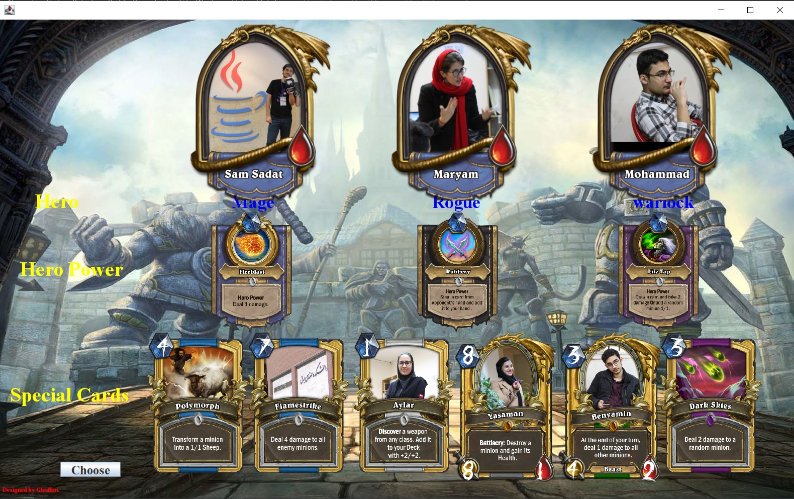
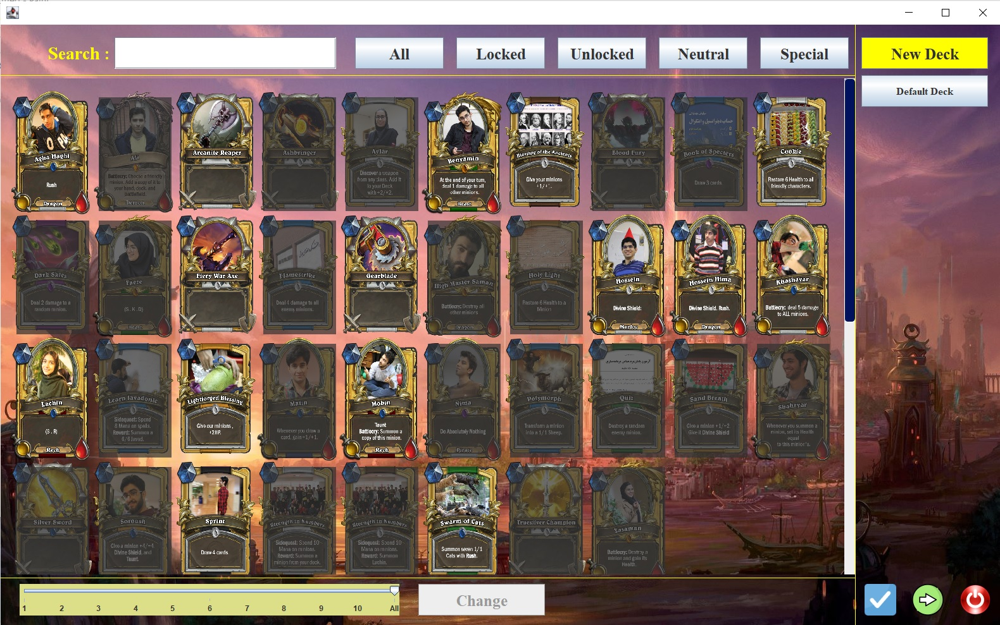
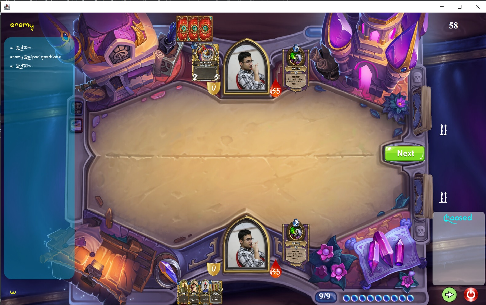

# Hearthstone

This is a fun recreation of an online card [game by Billizard Ent](https://hearthstone.blizzard.com/en-us).

Based on MVC architecture.

The objective of the project was to acquire fundamental and intermediate knowledge of back-end and front-end
programming, game design concepts, and the development of a high-performance game that simultaneously supports multiple online and offline games using network and multithreading techniques. 

Client and Server are on different packages.

The User-Interface is created using built-in java library, swing.

Data is stored in PostgreSql database.

You can play several 2-player online games at the same time.

